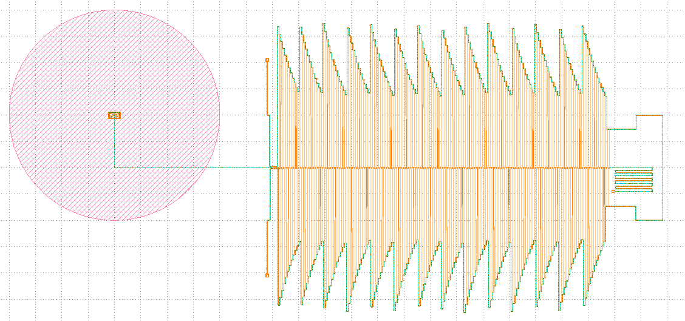

# PyCIF

PyCIF: Collaborative CAD platform for hierarchical design of on-chip imaging devices



## Documentation
Check out the (work-in progress) documentation at https://gitlab.tudelft.nl/exp-ast/pycif-doc/

## Installing

Since the TU Delft gitlab is password-protected,
`pip` will ask you to log in.
If you haven't already,
create an access token with `read` permissions from the Gitlab webui.
When pip asks for credentials,
use your netid as the username
and the token as the password.

```bash
pip install git+https://gitlab.tudelft.nl/exp-ast/pycif
```

## Installing in development mode

Installing in editable/development mode will allow you to
edit PyCIF source code
and have the changes be immediately available,
without having to reinstall every time.

When cloning this repo
make sure that the name of the folder it gets cloned into
is different to the name of the package (i.e. `PyCIF`),
since that could cause issues.
The check is case-sensitive,
so something like
`pycif` should be fine.

```bash
# Clone this repo
git clone https://gitlab.tudelft.nl/exp-ast/pycif

# Install in development mode
pip install -e ./pycif
```

## Examples

Make sure PyCIF works by compiling the built-in Snowman component:

```bash
python -m PyCIF export cif PyCIF:Snowman -o snowman.cif
```

Want a more *involved* example? Check out [DeshimaDemo](https://gitlab.tudelft.nl/exp-ast/pc_deshimademo)!

